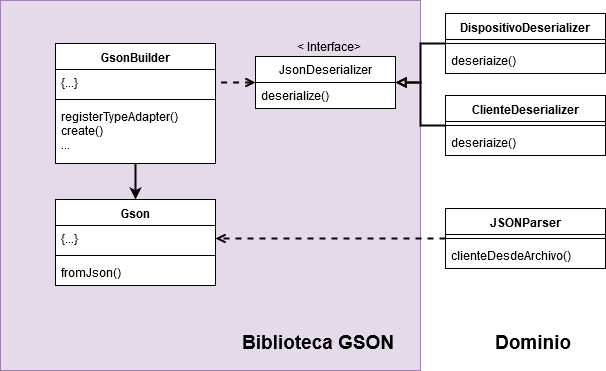

# Especificación de responsabilidades

## RepositorioCategoria
Ésta clase se va a instanciar una sola vez, posee una lista  con de cada tipo de categoría. Se encarga de iterar sobre la misma preguntando cuál categoría corresponde. No calcula directamente si el consumo del cliente cae en el rango de cada categoría, ya que de eso se encargan ellas. Debido a ésto decidimos diseñarla como un Singleton, ya que no necesitamos más de una instancia de ésta clase. Todos los clientes recurrirán al mismo repositorio a la hora de recategorizarse.

## Categoría
Ésta clase tiene la responsabilidad de verificar si un consumo dado pertenece a su rango de aceptación. Para ello posee un límite inferior y uno superior.
``` java
def Boolean correspondeCategoria(consumo){
    return(this.limiteInferiorDeConsumo < consumo) && (consumo <=this.limiteSuperiorDeConsumo);
}
```
## Cliente
Decidimos por el momento calcular su consumo como los kwh de todos sus dispositivos encendidos, ignorando cualquier otro factor (como el tiempo que mantiene encendido cada uno de ellos).
``` java
def Double consumo(){
    this.dispositivos.stream()
        .filter((Dispositivo dispositivo) -> dispositivo.estaEncendido())
.mapToDouble((Dispositivo dispositivo) ->dispositivo.getkWh()).sum();
}
```
Ahora hablando sobre el método recategorizar:
``` java
def void recategorizar(){
    RepositorioCategorias repositorio = RepositorioCategorias.getInstance();
    public void recategorizar() {
        RepositorioCategorias repositorio = RepositorioCategorias.getInstance();
        this.categoria = repositorio.categorias().stream()
                .filter(categoria -> categoria.correspondeCategoria(this.consumo())).findFirst();
    }
this.categoria = repositorio.categoriaCorrespondiente(this.consumo());
}
```
Como todas las clases entienden mensajes( como el mensaje “new),le mandamos a la clase el mensaje “getInstance”, que devolverá la única instancia de esa clase, o creará una si todavía no la había creado.
## RepositorioCategoria
``` java
static RepositorioCategorias instancia;
def getInstance(){
    if(instancia==null){
        return new RepositorioCategorias();
    else{
      return instancia;
    }
}
```
Entonces en el método recategorizar, obtenemos dicha instancia y la clase Cliente tendrá la responsabilidad de encontrar la categoría que le corresponda. Para esto, busca en la instancia todas las categorías existentes y las filtra hasta encontrar la primera que se corresponda con el consumo calculado para el cliente en cuestión.
Esta fue una decisión de diseño que llevamos a cabo, teniendo en cuenta que la otra alternativa era pasarle a la clase RepositorioCategorias la responsabilidad de encontrar la categoría que le corresponda. Finalmente decidimos inclinarnos por la primera, lo que permite un repositorio de categorias más cohesivo.
## Parser JSON
A la hora de implementar la creacion de usuarios a partir de un archivo con formato json, decidimos emplear la biblioteca GSON, la cual implementamos de la siguiente manera; Creamos dos clases deserializadoras (ClienteDeserializer y DispositivoDeserializer) que sirven de estrategia al objeto de la clase Gson, encargado de hacer el parseo, e implementamos una clase (JSONParser) que cumple con el rol de adaptar la interfaz de la biblioteca a la que requiere nuestro dominio


